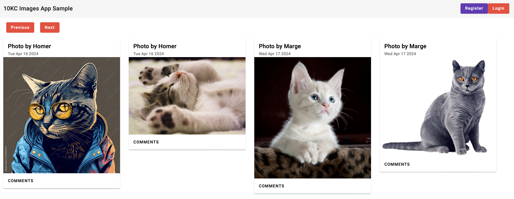
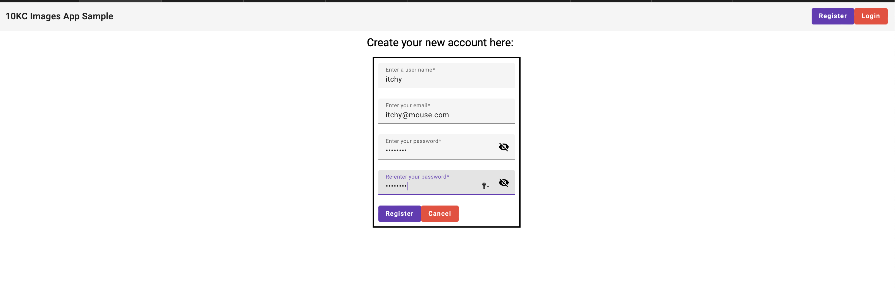
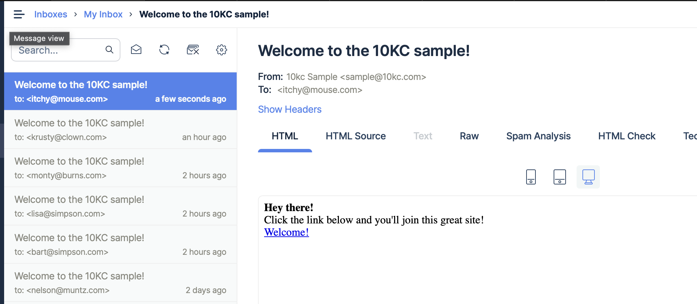
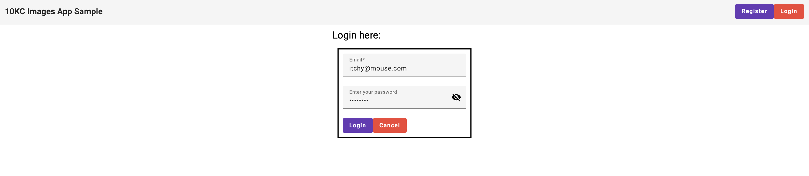
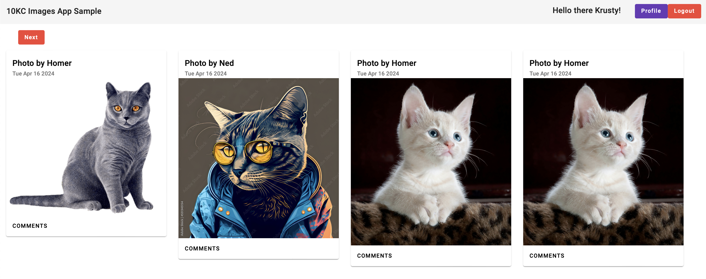
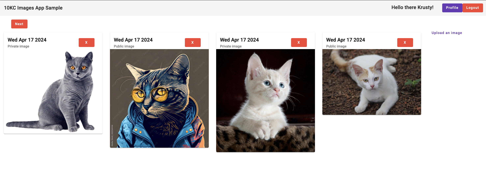
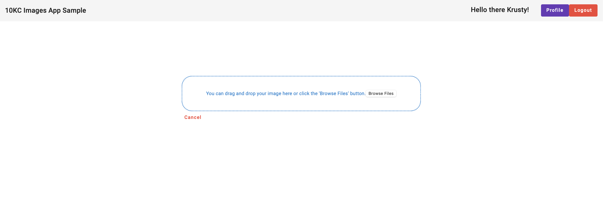
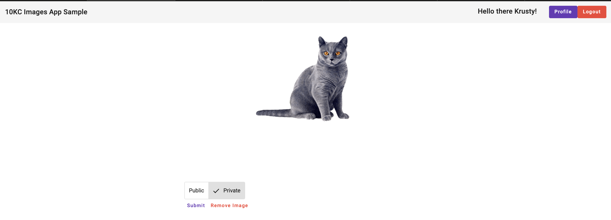
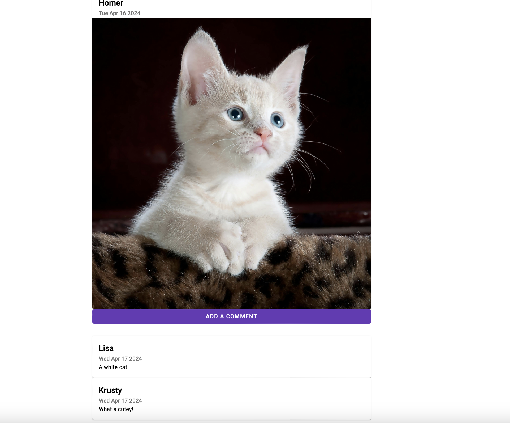

# 10kc-photo-app-sample-submission

> [!NOTE]
> This is a sample photo app I'm making for a 10KC challenge. Built in about and in need of significant refactoring. **NOT FOR PRODUCTION**.


Before running the app, be sure to edit the `.env` file to add the appropriate values for the associated variables such as database conenction string and database name.

```
DB_CONN_STRING="YOUR_MONGO_DB_CONNECT_URL"
DB_NAME="YOUR_MONGO_DB"

JWT_SECRET="SOME_SECRET"
JWT_ISSUER="10KC_SAMPLE_ISSUER"
JWT_AUDIENCE="10KC_SAMPLE_APP"

SMTP_HOST='YOUR_SMTP_HOST'
SMTP_SENDER='YOUR_SENDER_EMAIL'
SMTP_PORT='PICK_YOUR_PORT_BUT_NOTE_ENCRYPTION_NOT_SETUP'

SMTP_USERNAME='YOUR_SMTP_HOST_USER_NAME'
SMTP_PASSWORD='YOUR_SMTP_HOST_PASSWORD'

PASSWORD_HASH_ITERS=10
PASSWORD_PEPPER='YOUR_PEPPER'

TOKEN_EXPIRATION_TIME_IN_MINUTES=60
TOKEN_EXPIRATION_TIME_FOR_VALIDATION_IN_HOURS=60

EMAIL_AUTHENTICATION_BYPASS=1
```

This app does use email authentication to validate users so if you wish to activate accounts you'll need an SMTP service.

I had success using [mailtrap.io](https://mailtrap.io).

After you have everything setup, you should be able to build and run the app with command.

```
npm run setup-build-and-run
```

This will handle the package installation for the server and Angular client. It will also build the Angular client for you even if you don't have the `@angular/cli` installed globally.

After the command is run, provided the other configurations are done in the `.env` file, you should be able to see the app running at `http://localhost:8080/`.

There's still a lot of work the app would need to be production ready and quite a few smells due to time constraints but you can see how the app should look as it's running in your browser below.

# Homepage

When first entering the site if there are no images loaded up you should simply see a blank screen with buttons to register or login at the upper right.

The page is configured to show four images at a time and to showcase cursor based pagination I had a simple `Previous` and `Next` button setup to iterate through images stored in the database. Images are displayed from oldest to newest.

Comments are also accessible for iamges but you won't be able to post comments without first being signed in.



# Registration

> [!NOTE]
> This sample is for demonstration purposes only and is not secure. If you do provide an email address I highly recommend you use a testing email delivery platform like [mailtrap.io](https://mailtrap.io). Would also highly discourage using passwords associated with actual accounts!
>
> You can bypass this step entirely by setting the `EMAIL_AUTHENTICATION_BYPASS` value in the `.env` file to `1` If you want it to be activated it's easier to just either leave the value blank or remove it from the `.env` file entirely. 

If you haven't made an account you can make one at the register button and follow a simple prompt to provide a username, email and password.



After you do this the server will send the provided email address a link for account activation. After clicking the link the account will be activated and you can login.








# Profile

After a user signs in they will have access to their profile page which will show all of the images they have uploaded. Both private and public (labeled as such on the cards). This page only shows images posted by the user and has pagination similar to the home page with four images shown per page. Like the home page these images are sorted from oldest to newest.



# Uploading Images

In the profile page there's a button in the upper right labelled **Upload an image**.

Clicking this button navigates the user to the image upload section of the profile where images can be uploaded and marked as public or private after preview.





# Comments

Each image in the home page has comments which can be viewed by anyone but only signed in and registered users will be able to make comments as displayed below.



